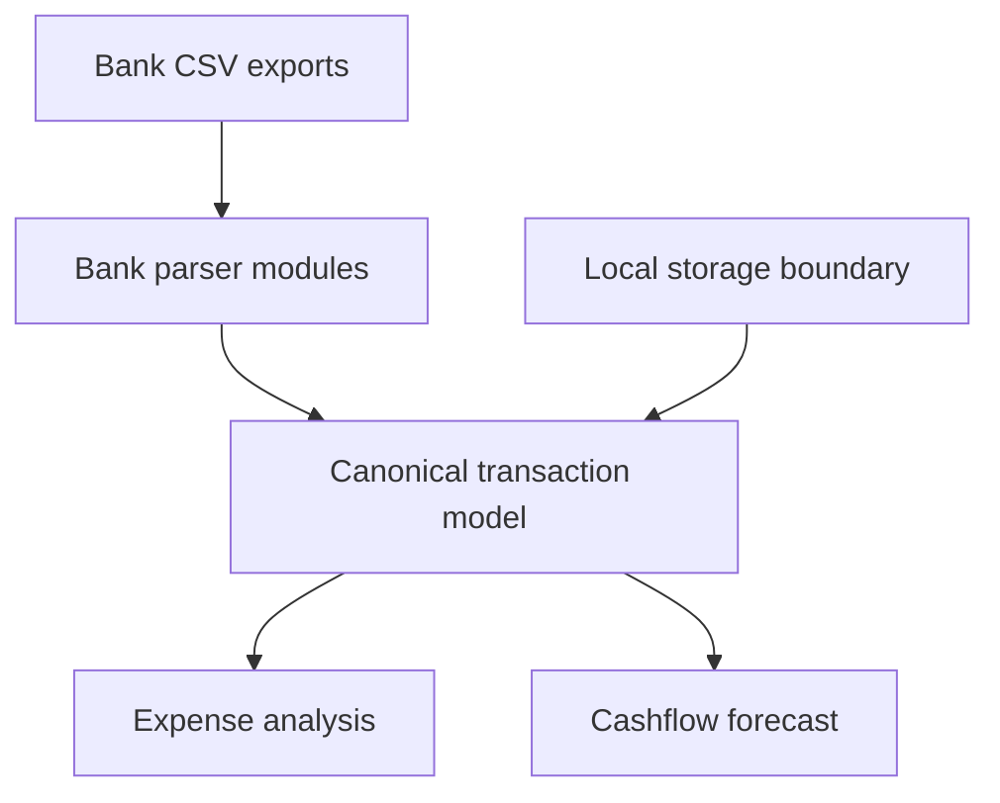

## adr_001_cashflow_lab_architecture_direction - Cashflow Lab architecture direction
> Date: 2026-07-04
> Status: Accepted
> Drivers: local-first privacy, CSV-first import, monthly deterministic forecast, later cloud optionality
> Related request: `req_000_cadrer_mvp_cashflow_lab`
> Related backlog: `item_001_cadrer_le_mvp_cashflow_lab`, `item_002_creer_mvp_cashflow_lab`
> Related task: `task_001_cadrer_le_mvp_cashflow_lab`, `task_002_creer_le_mvp_cashflow_lab`
> Reminder: Update status, linked refs, decision rationale, consequences, and follow-up work when you edit this doc.

# Overview
This ADR captures the starting architecture and requirements direction for Cashflow Lab. The product begins as a local desktop-in-browser app that imports CSV exports from French banks, normalizes transactions, and forecasts future cashflow without paid aggregation.

# Context
- The user wants to aggregate Credit Agricole, LCL, and Fortuneo manually through CSV first.
- The first account scope covers current accounts, cards, Livret A, and LDDS.
- Primary needs are expense control and future cashflow forecasting.
- Cloud and mobile access may matter later, but the MVP should not depend on them.
- The app must not store bank credentials or scrape banking portals.
- Real non-anonymized CSV exports are available locally outside the public repository; raw data must remain out of Git.
- Card handling starts with debit immediate only.
- Forecasting starts at monthly granularity.
- Balances should be recalculated from transactions and enriched from CSV balance data if available.
- Local encryption is deferred to a second phase.

# Decision
- Build a local-first browser app, initially served locally during development.
- Use bank-specific CSV parser modules feeding a canonical transaction model.
- Use deterministic monthly forecast rules for recurring movements and planned one-off events.
- Put a storage adapter boundary around persistence so the first local store can evolve toward encrypted local storage or later sync.
- Prefer React with Vite for the app shell unless repository constraints later point to another stack.
- Use SQLite (sql.js/WASM) for durable local data from the first slice, behind a storage adapter boundary; skip the throwaway browser-storage prototype.
- Implement Credit Agricole and Fortuneo CSV parsers first (their exports exist locally); add the LCL parser once an LCL export is provided. Keep the canonical model and import pipeline bank-agnostic so LCL plugs in without schema changes.
- The default monthly dashboard shows total spending, category split, account split, and top merchants.

# Consequences
- The MVP can deliver value without external banking APIs or recurring provider costs.
- CSV parser tests become critical because bank export formats may vary.
- Deduplication and import traceability must be designed early.
- Forecast precision depends on explicit user assumptions, so the UI must make those assumptions editable.
- A later mobile/cloud phase will require authentication, sync conflict handling, encryption, and hosting decisions.

# Requirements
- Import CSV files from Credit Agricole, LCL, and Fortuneo.
- Store import batch metadata, parser version, and row-level traceability.
- Normalize dates, labels, amounts, currencies, accounts, and transaction direction.
- Detect duplicates across repeated imports.
- Support category assignment through editable rules.
- Detect and model internal transfers between owned accounts.
- Exclude internal transfers from spending totals by default.
- Show spending by month, category, account, and merchant.
- Define recurring rules with amount, cadence, account, category, start date, and optional end date.
- Define one-off forecast events.
- Compute projected balances per account and globally.
- Export normalized transactions and forecast assumptions.
- Provide default categories: logement, courses, soirees, bricolage, sante, sport, loisirs.

# Data model draft
- `Account`: bank, account type, display name, currency, opening balance policy.
- `ImportBatch`: source bank, file name, imported timestamp, parser version, row count.
- `Transaction`: account, booking date, optional value date, label, merchant, amount, currency, source row hash, category, transfer group.
- `Category`: name, parent category, behavior for spending, income, or transfer.
- `CategoryRule`: match condition, priority, target category, optional merchant normalization.
- `RecurringRule`: account, label, category, amount, cadence, next date, start date, optional end date.
- `ForecastEvent`: account, date, label, amount, category, confidence.
- `ForecastSnapshot`: generated date, horizon, assumptions version.

# First implementation slice
- Scaffold app and tests.
- Define canonical account and transaction schema.
- Implement CSV import for one real bank sample.
- Add import preview and deduplication.
- Add category rules.
- Add monthly spending view.
- Add 3 to 12 month recurring-rule forecast at monthly granularity.

# Risks
- CSV formats may differ by bank, account type, language, and export option.
- Future deferred debit card support may distort monthly cashflow if modeled too simply.
- Internal transfers may inflate spending unless excluded from expense views.
- Forecasts can look precise while relying on incomplete assumptions.
- The public repository must not receive raw private CSV files or filenames containing private identifiers.

# References
- Related request: `req_000_cadrer_mvp_cashflow_lab`
- Related backlog: `item_001_cadrer_le_mvp_cashflow_lab`, `item_002_creer_mvp_cashflow_lab`
- Related task: `task_001_cadrer_le_mvp_cashflow_lab`, `task_002_creer_le_mvp_cashflow_lab`
