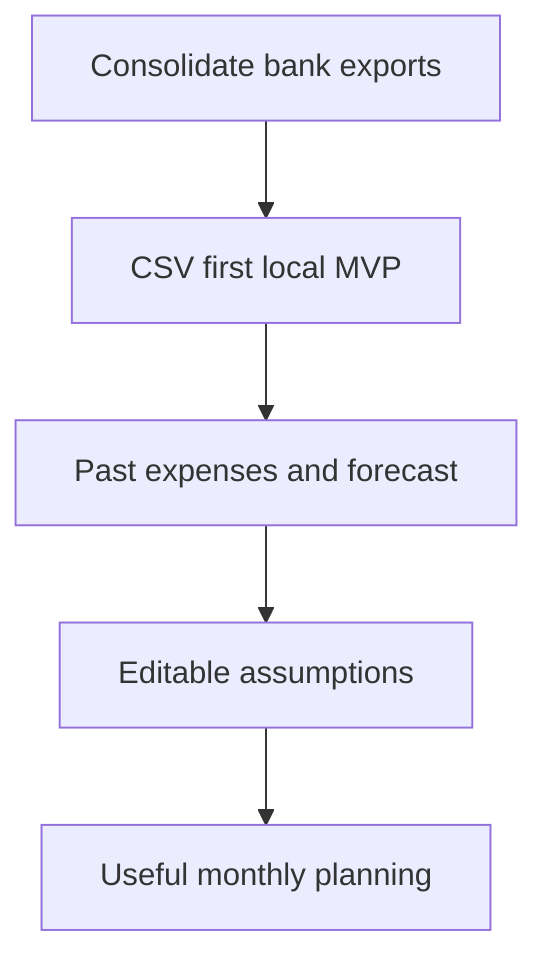

## prod_001_cashflow_lab_product_brief - Cashflow Lab product brief
> Date: 2026-07-04
> Status: Proposed
> Related request: `req_000_cadrer_mvp_cashflow_lab`
> Related backlog: (none yet)
> Related task: (none yet)
> Related architecture: (none yet)
> Reminder: Update status, linked refs, scope, decisions, success signals, and open questions when you edit this doc.

# Overview
Cashflow Lab is a local-first personal finance tool for consolidating CSV exports from Credit Agricole, LCL, and Fortuneo. The first release focuses on past expense control and forward-looking cashflow forecasting across current accounts, cards, Livret A, and LDDS.

The first version should avoid paid bank aggregation. CSV import is the primary ingestion path. Mobile or cloud access is a later option, not a first constraint.

# Goals
- Import bank CSV exports without paying for a bank aggregation provider.
- Normalize transactions across the target banks and account types.
- Track monthly spending by account, category, merchant, and period.
- Forecast upcoming cashflow from recurring movements and known one-off events.
- Keep data local, private, and exportable.

# Non-goals
- Paid Open Banking aggregation in the first release.
- Cloud sync and mobile access in the first release.
- Multi-user sharing.
- Investment portfolio tracking beyond simple account balances.
- Automated tax, accounting, or regulatory workflows.

# Scope and guardrails
- In: CSV import, transaction normalization, deduplication, manual categorization rules, monthly analysis, recurring rules, one-off forecast events, local storage, export.
- Out: bank credential storage, scraping banking websites, paid aggregation, hosted backend, mobile sync.
- Guardrail: the user must be able to inspect and correct imported data and forecast assumptions.
- Guardrail: internal transfers should be preserved for account balances but excluded from expense totals by default.

# Key product decisions
- Start CSV-first because the user does not want to pay for aggregation at this stage.
- Start local-first because financial data privacy matters and cloud access is only a second phase.
- Prefer deterministic forecasts over opaque predictions for the MVP.
- Treat category and merchant rules as editable user data.
- Keep export and backup available from the beginning to avoid lock-in.

# Success signals
- A CSV export from each target bank can be imported without manual spreadsheet cleanup.
- Re-importing a file does not duplicate transactions.
- The user can see spending by month and category across all target banks.
- The user can define recurring income and expenses.
- The user can see projected balances per account and globally for a 3 to 12 month horizon.
- The app can run locally in a browser without a hosted backend.

# Open questions
- Which exact CSV formats and columns do Credit Agricole, LCL, and Fortuneo currently export?
- Should card transactions be modeled as direct account movements or as separate card accounts with settlement entries?
- Should the first forecast be daily, weekly, or monthly?
- Which default categories should ship in the first version?
- Should balances be imported, manually entered, or derived from transactions?
- What level of local encryption is required for the MVP?

# References
- Request: `req_000_cadrer_mvp_cashflow_lab`
- Backlog: `item_001_cadrer_le_mvp_cashflow_lab`
- Architecture: `adr_001_cashflow_lab_architecture_direction`
- Task back-reference: `task_001_cadrer_le_mvp_cashflow_lab`
